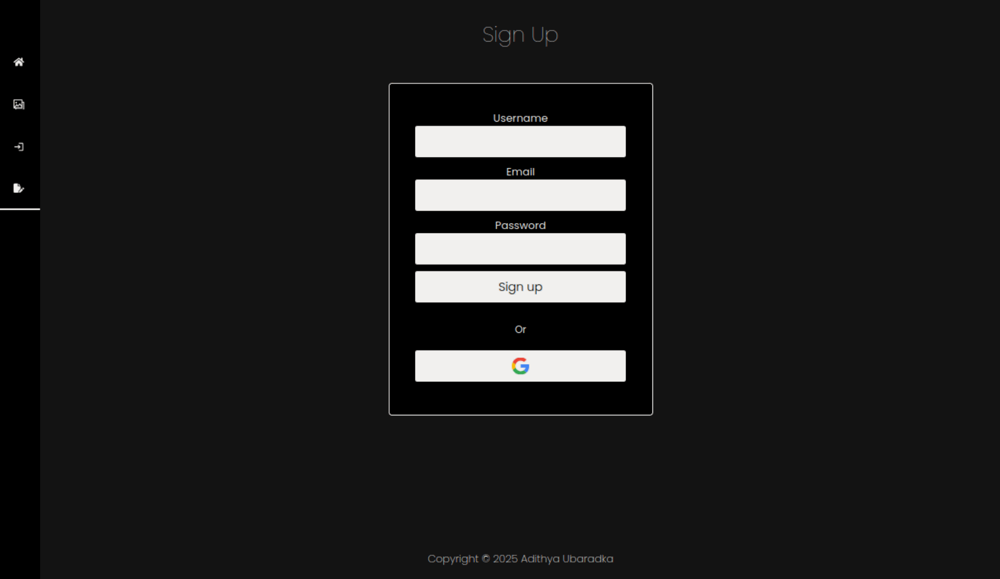

# Easel

## Overview

This is a simple art gallery where people can create and account, post there art and get feedback in the form of comments and/or likes.    I mainly used this project to get started with full stack development.  The site was originally deployed to Vercel, but I took it down under the future prospect of the site being difficult to maintain.
 
 
You can still run this on your local machine:  
1. Just clone the repository 
2. Add a .env file with all the environment variables (Vercel Postgres, Vercel Blob and Clerk)  
3. Set up the database (schema provided in database.sql)

## Technology Used

Frontend: Next.js, CSS   
Backend: Next.js, PostgreSQL (Vercel), Blob (Vercel), Clerk, Ngrok (for testing webhooks)

## Features

### 1. User authentication:

  Users can create their account using the traditional username, password and email, or use their gmail account.  This is facilitated by Clerk.
   
### 2. Restricted file upload:

   When creating a post, users can only upload 1 image and of a finite size (in terms of storage).

### 3. Database fetch caching for faster navigation and lesser loading (with reasonable refresh timings):

   Using NextJS unstable_cache, this is acheived.  All database fetches are done using server actions.
   
### 4. Fuzzy search for usernames in the gallery:

   Using PostgreSQL's trigram comparison approach to search.  For categories, full-text search with semantic search (using an LLM) could also be done (not implemented).
   
### 6. UUID encryption of sensitive information in the urls:

   To reduce the use of useState Hooks, information is passed in the urls as queries. Sensitive information (here, the post_id) is encrypted using UUID.   
   
### 7. File uploaded can be of any dimension:

  The images can be of any dimension. The UI has been designed to accomadate variable sized images.

    
